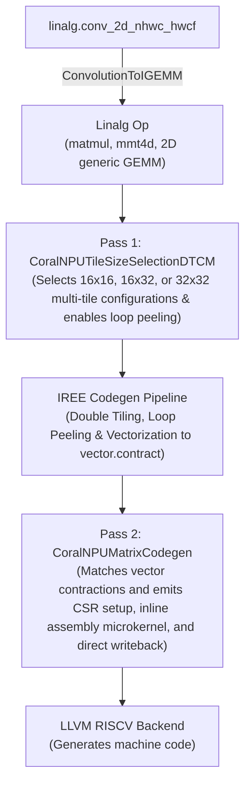

# CoralNPU Matrix Codegen Design & Implementation

This document describes the design and implementation of the direct codegen path in the CoralNPU compiler targeting the RISC-V **Zvt (Matrix)** extension.

## 1. Overview

The Zvt extension adds matrix-multiply instructions to the CoralNPU. The goal of this codegen path is to lower matrix multiplication operations (`linalg.matmul`, 2D `linalg.generic` contractions and `linalg.mmt4d`) and, once enabled (§2.0), convolutions via implicit GEMM directly to Zvt instructions when supported by the hardware, falling back to the standard vector (RVV / Zve) path otherwise.

The Zvt unit computes outer-product multiply-accumulates with $TM=16, TN=16, TK=1$. It has 16 tile registers (`mt0`–`mt15`); a $16 \times 16$ tile of 32-bit accumulators occupies four of them, so the four 32-bit accumulators are `mt0`, `mt4`, `mt8` and `mt12`.

To reuse loaded operands across tiles and interleave the accumulators so consecutive multiplies target different tiles, the compiler picks one of three accumulation layouts by shape:
*   **$2 \times 2$ Multi-Tile Grid** ($32 \times 32$ output block per iteration) utilizing all 4 independent 32-bit matrix accumulators (`mt0`, `mt4`, `mt8`, `mt12`), each updated once per K step, when $M$ and $N$ are both multiples of 32 and the full-K tile fits the DTCM (§2.1).
*   **$1 \times 2$ Multi-Tile Strip** ($16 \times 32$ output block) utilizing 2 accumulators (`mt0` and `mt4`) when only $N$ is a multiple of 32, or the $32 \times 32$ tile does not fit.
*   **$1 \times 1$ Single-Tile** ($16 \times 16$ output block) utilizing `mt0` otherwise, and always for `linalg.mmt4d`.

---

## 2. Compilation Pipeline



### 2.0. ConvolutionToIGEMM (Preprocessing)
`CoralNPUSession::extendPreprocessingPassPipeline` invokes IREE's `ConvolutionToIGEMMPass` (`createConvolutionToIGEMMPass`) with a CoralNPU affinity filter before partitioning, converting convolutions targeted for CoralNPU into an implicit GEMM format (`iree_linalg_ext.im2col` + a generic contraction op):
*   **Target-Aware**: Only converts convolutions whose `stream.affinity` device symbol name contains `coralnpu` (see Current status).
*   **Affinity Propagation**: The generated generic GEMM operation inherits the `coralnpu` `stream.affinity` attribute from the source convolution.
*   **GEMM Mapping**: The generic contraction is a Zvt candidate only if its M dimensions (N, OH, OW) collapse to one, giving the two-parallel-loop, rank-2 shape `isZvtMatrixContraction` requires; this is unverified, since the filter never matches in a real compile.
*   **Current status**: in a real compile no convolution carries a CoralNPU `stream.affinity` during preprocessing (`CoralNPUAffinityAnnotation` assigns affinity to dispatches later, in DispatchCreation, and device globals are named `@__device_N`), so the filter never matches and convolutions take the RVV fallback. Enabling it needs an earlier placement decision and a convolution allowlist; depthwise and dilated convolutions produce `im2col` that fails to lower.

### 2.1. Pass 1: CoralNPUTileSizeSelectionDTCM (Configuration & Loop Peeling)
This pass picks the DTCM (cache-level) tile sizes for the root Linalg operation (`CPUDoubleTilingExpert` pipeline); for a Zvt contraction whose full-K tile fits, it also replaces the RVV vector parallel tile sizes set by `CoralNPUTileSizeSelectionRegister`:
*   **Contraction Detection**: Uses `isZvtMatrixContraction(op)` (gated by `hasZvtTargetFeature(op)`) to identify Zvt-compatible 2D contractions (`linalg.matmul` and 2D `linalg.generic` contractions with A $M \times K$ or $K \times M$, B $K \times N$ and C $M \times N$) and `linalg.mmt4d` operations across FP32 (FP32 $\times$ FP32 $\to$ FP32), BF16 (BF16 $\times$ BF16 $\to$ FP32) and INT8 (INT8 $\times$ INT8 $\to$ INT32). It also requires a static init shape; for 2D contractions two parallel loops, one reduction loop and $M$, $N$ multiples of 16; for `mmt4d` a static LHS shape and $16 \times 16 \times 1$ inner tiles; no `linalg` consumer in the dispatch (e.g. a fused bias, activation or truncation keeps the op on RVV), and an init that is a zero constant, a zero `linalg.fill` or a value loaded from memory (the tiles are zeroed or seeded from it); a computed init stays on RVV.
*   **Loop Dimension Order**: `parallelLoops` is innermost-first, so `parallelLoops[0]` is N (columns) and `parallelLoops[1]` is M (rows).
*   **Multi-Tile Register Selection**:
    *   $M$ and $N$ multiples of 32: **$2 \times 2$**, `mTile = nTile = 32`.
    *   Only $N$ a multiple of 32: **$1 \times 2$**, `mTile = 16, nTile = 32`.
    *   Base fallback tile configuration, and always for `linalg.mmt4d`: `mTile = 16`, `nTile = 16`.
*   **DTCM Fit**: `CoralNPUMatrixCodegen` cannot lower a split K loop, so the tile shrinks ($32 \times 32 \to 16 \times 32 \to 16 \times 16$) until a full-K DTCM tile fits `--coralnpu-dtcm-size-kb`; otherwise the op stays on RVV.
*   **Loop Peeling**: Adds `enable_loop_peeling` to the `translation_info` configuration when the root op takes the Zvt tile sizes (a Zvt contraction whose full-K tile fits), so a dimension that is not a multiple of the DTCM tile size (e.g. 160 tiled by 64) yields a static remainder subview instead of a masked `affine.min` slice, which cannot lower to fixed $16 \times 16$ Zvt ops.

### 2.2. Vectorization & Pre-LLVM Lowering Hook
This phase runs the standard IREE codegen pipeline:
*   **Double Tiling & Vectorization**: Lowers Linalg operations into 2D `vector.contract` operations (e.g., `vector<16x16xf32>`, `vector<16x32xf32>`, or `vector<16x32xi32>`).
*   **Pre-LLVM Lowering Hook (`beforeLowerToLLVMHook`)**: Before converting to LLVM dialect, `CoralNPUTargetBackend` invokes a callback that executes:
    1.  `CoralNPULimitLoopUnrollingPass`: limits LLVM loop unrolling to bound ITCM code size.
    2.  `DropVectorUnitDimsPass`: Folds unit vector dimensions.
    3.  `CoralNPUMatrixCodegenPass`: Lowers supported vector contractions to Zvt inline assembly.

### 2.3. Pass 2: CoralNPUMatrixCodegen
This pass runs on MLIR `FunctionOpInterface` within `beforeLowerToLLVMHook` and converts vector contractions into Zvt inline assembly:

> [!NOTE]
> **Why raw inline assembly rather than the `llvm.riscv.zvt.*` intrinsics.**
> 1. The tile configuration has to live in the same assembly block as the tile
>    operations it governs (step 2 below); with intrinsics, LLVM is free to place
>    a `vsetvli` in between, which would clear `mtype` and `vtype.altfmt`.
> 2. The K-loop is written as an assembly loop so its body and code size are
>    fixed by construction rather than left to the unroller — ITCM is small, and
>    a contraction-level lowering would expand per K step.
> 3. The fused microkernel and the seed/drain blocks use a fixed register
>    assignment (`t0`–`t6`, `v0/v4/v8/v12/v24`); unfused multiply blocks take
>    `^vr` operands that LLVM allocates.
>
> The cost is deliberate: the register allocator is shut out of the microkernel,
> and the `~{memory}` clobber on the microkernel and seed/drain blocks prevents
> scheduling and alias analysis across them.
> `llvm-project-0001-add-zvt-support.patch` also defines the full Zvt intrinsic
> and ISel surface; this pass does not use it today and it is kept for ISA
> completeness and eventual upstreaming. The *instruction*
> definitions in `RISCVInstrInfoZvt.td` are not optional — the inline assembler
> needs them to parse `vtmms.tvv`, `vtfmm.tvv`, `vtfmm.alt.tvv`, `vtzero`, the
> `vtmv` tile moves and the `mset*` family.

1.  **Contraction Identification & Chain Analysis**:
    *   Gates the pass on `hasZvtTargetFeature(funcOp)` (`backend == "coralnpu"` and `+zvtbase`), then walks `vector.contract` operations and validates hardware constraints (`isSupportedMatrixContraction`), including that C is indexed $M \times N$ (rows from LHS, columns from RHS).
    *   Identifies accumulator chains: an `add` contraction, optionally the only value carried by a K-reduction `scf.for`, whose result is written back by one in-bounds `vector.transfer_write` or, after a loop, by per-row `vector.extract` + `vector.store` covering every row of one tile. A loop's writes must be in the loop's block.
    *   Traces through type conversions and vector operations (`arith.extsi`, `arith.extf`, `vector.shape_cast`, `vector.broadcast`, `vector.extract_strided_slice`, `vector.from_elements` of extracts) to identify the source element precision (FP32, BF16 or INT8).
    *   Detects input matrix layouts: whether Matrix A is contiguous/transposed ($K \times M$) or standard strided ($M \times K$); Matrix B must be $K \times N$ (tile selection rejects other 2D layouts). To fuse, the K induction variable must be the row of B and the row or innermost index of A, both row-major (unit inner stride). Addresses fold every memref index, so rank-3/4 `mmt4d` operands with outer-tile indices are handled.
2.  **Hardware CSR Configuration**:
    *   Every emitted assembly block opens with its own configuration preamble rather than relying on a single setup at function entry. This is mandatory: `vsetvli`/`vsetivli`/`vsetvl` clear `mtype` (`mtwiden`/`tk`/`tm`) and `vtype.altfmt` (see `RvvFrontEnd.sv`), and LLVM's vsetvli-insertion pass may place one between any two assembly blocks.
    *   The preamble is `li t5, <mtype>; li t6, <vtype>; msetmtype t5, t6; li t6, 16; msettn zero, t6` (clobbering `t5`/`t6`):
        *   **FP32 Mode**: `msetmtype(16417, 18)` with $TM=16, TK=1, mtwiden=1$, and `vtype = 18` (`SEW=32, LMUL=4`).
        *   **INT8 Mode**: `msetmtype(16419, 256)` with $TM=16, TK=1, mtwiden=3$ (widening INT8 $\to$ INT32 accumulation), and `vtype = 256` (`SEW=8, LMUL=1`, `altfmt=1`). `altfmt` (bit 8) makes the *second* matmul operand signed; `vtmms.tvv` only encodes the first operand's signedness in the opcode, so without it the hardware computes signed $\times$ unsigned.
        *   **BF16 Mode**: `msetmtype(16418, 265)` with $TM=16, TK=1, mtwiden=2$, and `vtype = 265` (`SEW=16, LMUL=2`, `altfmt=1`). As with INT8, the opcode sets the first operand's type (`vtfmm.alt.tvv` = BF16 rather than FP16) and `altfmt` sets the second's.
    *   Because `msetmtype` derives `LMUL`/`ta`/`ma` from `SEW` when `mtwiden != 0` (`SEW8` $\to$ `m1`, `SEW16` $\to$ `m2`, `SEW32` $\to$ `m4`) and programs `TM` and `TK` directly, it fully replaces a `vsetivli` + `msettm` pair. It zeroes `vl`, so `msettn` restores $TN=16$. No `vset*` instruction appears in any Zvt block.
    *   Blocks that clear, seed or drain the accumulators use the FP32 configuration regardless of input type, since the accumulator tiles are always 32-bit; INT8 and BF16 blocks then switch to the narrow configuration before the operand loads and multiplies.
3.  **Inline Fused Assembly Microkernels**:
    *   Emits an assembly loop with loop counter `t6` (`li t6, numKSteps; 1: ...; addi t6, t6, -1; bnez t6, 1b`), so code size does not grow with K.
    *   BF16 uses `vtfmm.alt.tvv` wherever FP32 uses `vtfmm.tvv` below.
    *   The `vtzero` steps below apply to a zero `acc`; a loaded `acc` seeds the tiles instead (item 6).
    *   **$2 \times 2$ Multi-Tile Grid Accumulation ($32 \times 32$)**:
        *   Zeroes all 4 accumulators: `vtzero mt0`, `vtzero mt4`, `vtzero mt8`, and `vtzero mt12`.
        *   Loads LHS Tile 0 (`v4`) and LHS Tile 1 (`v24`).
        *   Loads RHS Tile 0 (`v8`) and RHS Tile 1 (`v12`).
        *   Issues four multiplies, each to a different accumulator:
            *   Tile 0 (top-left, rows 0..15, cols 0..15): `vtfmm.tvv mt0, v4, v8` (FP32) / `vtmms.tvv mt0, v4, v8` (INT8).
            *   Tile 1 (top-right, rows 0..15, cols 16..31): `vtfmm.tvv mt4, v4, v12` (FP32) / `vtmms.tvv mt4, v4, v12` (INT8).
            *   Tile 2 (bottom-left, rows 16..31, cols 0..15): `vtfmm.tvv mt8, v24, v8` (FP32) / `vtmms.tvv mt8, v24, v8` (INT8).
            *   Tile 3 (bottom-right, rows 16..31, cols 16..31): `vtfmm.tvv mt12, v24, v12` (FP32) / `vtmms.tvv mt12, v24, v12` (INT8).
        *   Each loaded LHS/RHS register feeds two multiplies.
    *   **$1 \times 2$ Multi-Tile Strip Accumulation ($16 \times 32$)**:
        *   Zeroes accumulators: `vtzero mt0` and `vtzero mt4`.
        *   Loads the LHS column (16 elements of $A$ at the current $k$) into `v4` once per $K$-step.
        *   Loads RHS Tile 0 into `v8` and RHS Tile 1 into `v12`.
        *   Issues two multiplies:
            *   FP32: `vtfmm.tvv mt0, v4, v8` and `vtfmm.tvv mt4, v4, v12`.
            *   INT8: `vtmms.tvv mt0, v4, v8` and `vtmms.tvv mt4, v4, v12`.
        *   Consecutive multiplies alternate between `mt0` and `mt4`.
    *   **Single-Tile Accumulation ($1 \times 1$, $16 \times 16$)**:
        *   Zeroes accumulator: `vtzero mt0`.
        *   Loads the LHS column (16 elements of $A$ at the current $k$) into `v4` once per $K$-step.
        *   Loads RHS into `v8`.
        *   Issues one multiply: `vtfmm.tvv mt0, v4, v8` (FP32) or `vtmms.tvv mt0, v4, v8` (INT8).
    *   **Contiguous vs. Strided Vector Loads**:
        *   For transposed LHS ($K \times M$), loads are contiguous unit-stride (`vle32.v` for FP32; `vle16.v` for BF16; `vle8.v` for INT8).
        *   For standard LHS ($M \times K$), loads use strided vector loads (`vlse32.v` for FP32; `vlse16.v` for BF16; `vlse8.v` for INT8).
        *   RHS ($K \times N$) loads are always contiguous.
4.  **Tile Writeback**:
    *   Extracts 32-bit rows from matrix accumulators using `vtmv.v.t` and stores them via `vse32.v` directly into Matrix C memory.
    *   `mt0` rows (top-left, rows 0..15, cols 0..15) are read with row index `t0` (`tss.tile = 0`).
    *   `mt4` rows (top-right, rows 0..15, cols 16..31) are read with tile index 4 via `lui t0, 0x20000` (`tss.tile = rs1[30:27]`).
    *   `mt8` rows (bottom-left, rows 16..31, cols 0..15) are read with tile index 8 via `lui t0, 0x40000`.
    *   `mt12` rows (bottom-right, rows 16..31, cols 16..31) are read with tile index 12 via `lui t0, 0x60000`.
5.  **Non-Fused Fallback**:
    *   When the chain cannot be fused into a single microkernel (no enclosing `scf.for`, a trip count that is not constant with lower bound 0 and step 1, a loop body that may write memory, or an LHS/RHS address that is not row-major with k the row of B and the row or innermost index of A), the contraction is lowered on its own: the LHS/RHS vectors stay as MLIR values passed through `^vr` inline-asm operands, and only the configuration preamble, the `vtfmm.tvv` / `vtfmm.alt.tvv` / `vtmms.tvv` multiplies and the tile writeback are emitted. This needs the widening `arith.ext` (if any) to be the operand's defining op; otherwise the contraction gets the generic lowering (last bullet).
    *   The accumulators are still initialized before the first multiply: a zero `acc` of a standalone contraction is cleared inline in its multiply block; otherwise a separate `vtzero` or seed block runs once immediately before the contraction or the unfused loop. Without this the tiles would retain whatever a previous microkernel left behind.
    *   Contractions the pass does not take are lowered at its end by MLIR's generic contract lowering, because `iree-v3.12.0-0006` makes `LLVMCPUVirtualVectorLowering` skip contract lowering in any function containing a Zvt-shaped contraction.
6.  **Accumulator Initialization**:
    *   A zero `acc` clears the tiles with `vtzero`. An `acc` loaded from memory (a row-major tile read, e.g. a matmul accumulating into its output) seeds them with the reverse of the writeback: `vle32.v` + `vtmv.t.v` per row. Any other `acc` (e.g. a computed bias) stays on RVV; `CoralNPUTileSizeSelectionDTCM` already rejects such inits.

### 2.4. LLVM RISCV Backend
The LLVM RISC-V backend supports the Zvt extension (`llvm-project-0001-add-zvt-support.patch`):
*   **Extension Features** (`RISCVFeatures.td`): `Zvtbase`, `Zvt8e`, `Zvt16e`, `Zvt64e`, `Zvti8i32mm`, `Zvtf8f32mm`, `Zvtf16f32mm`, `Zvtf32f32mm`. `CoralNPUTargetBackend` requests, by default, `+zvtbase,+zvt8e,+zvt16e,+zvti8i32mm,+zvtf16f32mm,+zvtf32f32mm`; `vtfmm.alt.tvv` is enabled by `Zvtf16f32mm` or `Zvtf8f32mm`.
*   **Instruction Registration** (`RISCVInstrInfoZvt.td`): encodings, pseudos and assembler support for `vtfmm.tvv`, `vtfmm.alt.tvv`, `vtmms.tvv`, `vtmmu.tvv`, `vtzero`, `vtmv.v.t`, `vtmv.t.v`, `msetmtype`, `msettm/tn/tk`, and the tile load/store family.
*   **VSETVLI Awareness** (`RISCVInsertVSETVLI.cpp`, `RISCVVSETVLIInfoAnalysis.cpp`): makes the VSETVLI passes account for the SEW/VL demands of Zvt pseudos (intrinsic pseudos only; this pass's inline asm is opaque to them).
*   **Intrinsics & ISel** (`IntrinsicsRISCVZvt.td`, `RISCVISelDAGToDAG.cpp`): the `llvm.riscv.zvt.*` surface, unused by this pass today (see the note in §2.3).

---

## 3. Supported Configurations

| Linalg Operation | Input Type | Accumulator Type | Extension | Target Instruction / Path | Status |
| :--- | :---: | :---: | :---: | :---: | :---: |
| `matmul`, `mmt4d` | **FP32** | **FP32** | `+zvtf32f32mm` | `vtfmm.tvv` (Zvt Hardware) | **Supported** |
| `matmul`, `mmt4d` | **BF16** | **FP32** | `+zvtf16f32mm` | `vtfmm.alt.tvv` (Zvt Hardware) | **Supported** |
| `matmul`, `mmt4d` | **INT8** | **INT32** | `+zvti8i32mm` | `vtmms.tvv` (Zvt Hardware) | **Supported** |
| `matmul`, `batch_matmul`, `mmt4d` | **INT16** | **INT32** | `+m,+f,+zvl128b,+zve32f` | RVV Vector Path / Fallback | **Supported** |
| `matmul`, `batch_matmul`, `mmt4d` | **INT32** | **INT32** | `+m,+f,+zvl128b,+zve32f` | RVV Vector Path / Fallback | **Supported** |
| `conv_2d_nhwc_hwcf` (via IGEMM) | **FP32** / **INT8** | **FP32** / **INT32** | `+zvtf32f32mm` / `+zvti8i32mm` | `vtfmm.tvv` / `vtmms.tvv` | **Not yet enabled** (see §2.0) |

The pass gates only on `+zvtbase`; the Extension column lists each instruction's feature, though the assembler also accepts `vtfmm.tvv` with `+zvtf16f32mm` and `vtfmm.alt.tvv` with `+zvtf8f32mm`. With `+zvtbase` but no accepted feature, the inline assembler rejects the instruction instead of falling back.

### Fallback Behavior
An operation compiles via IREE's standard RVV pipeline unless the target has `+zvtbase`, `isZvtMatrixContraction` accepts it (§2.1: supported element types; for 2D contractions B indexed $K \times N$ and $M$, $N$ multiples of 16, for `mmt4d` $16 \times 16 \times 1$ inner tiles; a zero or loaded init; no `linalg` consumer), and a full-K DTCM tile fits. A contraction `CoralNPUMatrixCodegen` still does not take (§2.3 item 5, last bullet) gets MLIR's generic contract lowering at the end of that pass.

---

## 4. Verification

### 4.1. Transform Unit Tests (MLIR Lit)
Unit tests for individual Zvt matrix compiler passes and lowerings are located in `tests/transforms/`:
*   `matrix_codegen.mlir`: Tests `CoralNPUMatrixCodegen` pattern matching, per-block CSR configuration (`msetmtype`, `msettn`) and the generated assembly: single-tile for FP32, BF16 and INT8; $1 \times 2$ multi-tile for INT8 and $2 \times 2$ for FP32; transposed LHS, zero and seeded accumulators, fused and unfused loops, writeback via `transfer_write` or per-row stores. In the negative cases, a CoralNPU target without `+zvtbase` and a non-CoralNPU backend are left untouched, and an unsupported $8 \times 8$ shape gets no assembly and falls to the generic contract lowering. A second `FileCheck` prefix asserts that no `vset*` is emitted anywhere in the output.
*   `convolution_to_igemm.mlir`: Tests affinity-aware convolution to implicit GEMM (`im2col`) conversion in `ConvolutionToIGEMM`.

To run the transform test suite:
```bash
# Using Bazel:
bazel test --config=dev //tests/transforms/...

# Or using CMake / CTest:
ctest -L ci -R transforms
```

### 4.2. End-to-End Model & Operator Integration Tests
Integration tests covering StableHLO and Linalg models (matrix multiplications, batched matmuls, and 2D convolutions) execute compiled bytecode modules directly on the CoralNPU runtime simulator:
```bash
# Run all CI test targets:
# Using Bazel:
bazel test --config=dev --keep_going //tests:ci

# Or using CTest (with matching CI label):
ctest -L ci -j 64
```

### 4.3. AOT Matmul Harness (MPACT / Verilator)
The harness in `examples/matmul-aot/` exports a JAX matmul to StableHLO, compiles it for the host plus CoralNPU, and runs it through the IREE Python runtime on **MPACT** (functional simulator, default) or **Verilator** (cycle-accurate RTL, `--use-verilator`). Each `test_matmul.sh` run compiles and runs with and without Zvt and prints simulated cycle counts to stderr. It passes `--coralnpu-roofline-speedup-threshold=0` so the matmul always runs on CoralNPU; with the default threshold the roofline model keeps small INT8 matmuls (e.g. $N=32$) on the host.

```bash
cd examples/matmul-aot

# 1. Functional Simulation on MPACT (default):
# Run standard FP32:
./test_matmul.sh

# Run FP32 with transposed LHS:
./test_matmul.sh --transpose-lhs

# Run INT8 with transposed LHS:
./test_matmul.sh --int8 --transpose-lhs

# Run BF16:
./test_matmul.sh --bf16

# 2. Cycle-Accurate Hardware RTL Simulation on Verilator:
# Pass --use-verilator to run on Verilator:
./test_matmul.sh --transpose-lhs --use-verilator

# 3. End-to-End linalg.mmt4d Verification (FP32, BF16 and INT8; zero and accumulator inits):
# Needs: bazel build --config=dev @iree_core//tools:iree-compile @iree_core//tools:iree-run-module
python3 test_mmt4d.py --bazel

# 4. Large matrices with 1 MB ITCM/DTCM on MPACT (default N=128):
./test_matmul_highmem.sh
```

#### Key Script Options
*   `--use-verilator`: Runs on the cycle-accurate Verilator RTL simulator instead of MPACT (default: `false`).
*   `-n`, `--size <N>`: Sets the square matrix dimension $N \times N$ (default: `32`). Large $N$ may fall back to RVV (see §2.1); `test_matmul_highmem.sh` builds with the 1 MB ITCM/DTCM linker script and `--coralnpu-dtcm-size-kb=1024`, allowing larger tiles and $N$.
*   `--transpose-lhs`: Exercises the contiguous unit-stride LHS load path (`vle32.v` / `vle16.v` / `vle8.v`) for matrix $A^T B$.
*   `--int8`: Exercises INT8 $\times$ INT8 $\to$ INT32 matrix multiplication via `vtmms.tvv`.
*   `--bf16`: Exercises BF16 $\times$ BF16 $\to$ FP32 matrix multiplication via `vtfmm.alt.tvv`.
